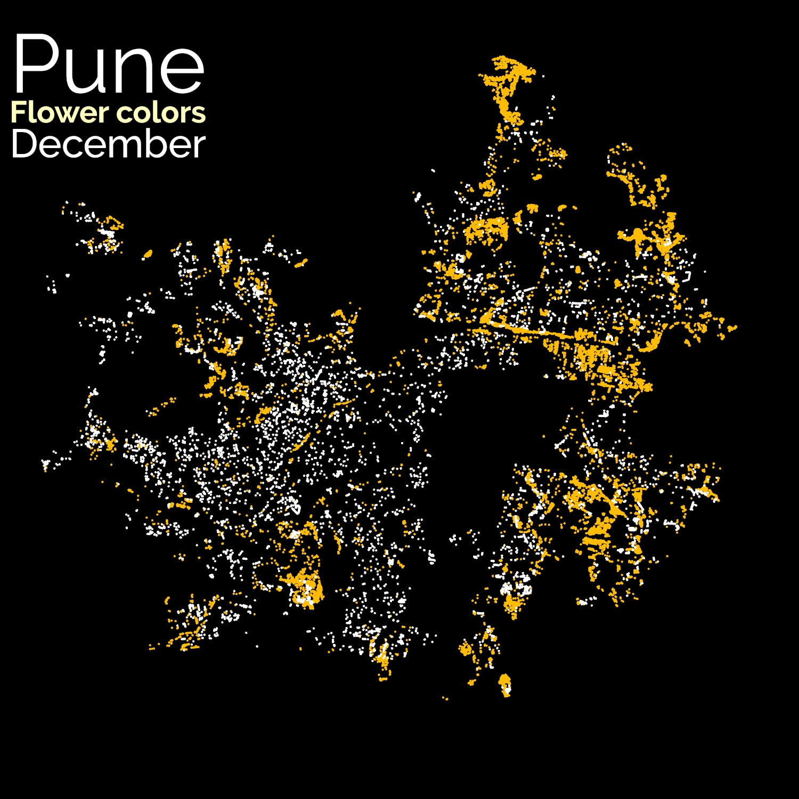

# Pune Tree Census 2015

The Tree Census was first conducted in 2015, and enumerated data on 3.2 million trees spread across the Municipal limits of Pune city. According to T.V. Ramachandran from the IISc, a ratio of 1 tree per person is required for a healthy urban environment. Given that the 2011 census indicated a human population of 3.12 million, we can consider this to be a healthy coverage. However we can also see a large imbalance in the location of these trees, with some areas having a greater density.

## Monthly Flowering Pattern

Despite being in the tropics, vegetation in Pune shows seasonal variation in both foliage and flowers.

These series of maps show which areas in the city flowers bloom by season or month. Flowering season peaks in the summer from March to May.

In June with the advent of the monsoon, trees are green again, with flowering decreasing steadily through the winter months, until it’s summer again. By December, almost all the flowers are gone.

|  |   |   |   |
|:-------------------------:|:-------------------------:|:-------------------------:|:-------------------------:|
|  |   |   |   |
|  |   |   |   |

## Flowering Animation:
These combined in an animated GIF file produce the following animation:

